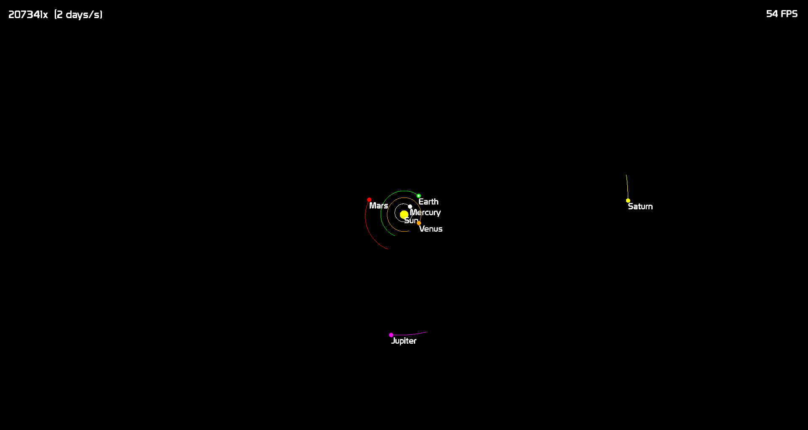

# Solar-System-Simulation
A numeric simulation for solar system using a simple Euler integration. Initial conditions are taken from NASA JPL Horizons database.

## Theoretical background

The simulation is based on Newton's law of universal gravitation. The force between two bodies is given by the formula:

$$
F = G \frac{m_1 m_2}{r^2}
$$

where $G$ is the gravitational constant, $m_1$ and $m_2$ are masses of the bodies and $r$ is the distance between them.

By dividng the force by the mass of the body, we get the acceleration of the body:

$$
a = \frac{F}{m} = G \frac{m_{\text{2}}}{r^2}
$$

where $m_2$ is the mass of the other body.

Using simple Euler integration, we can then calculate the new position and velocity of the body at each time step:

$$
v_{\text{k+1}} = v_{\text{k}} + a \Delta t
$$

$$
x_{\text{k+1}} = x_{\text{k}} + v_{\text{k+1}} \Delta t
$$


## Showcase



## Data

Data is taken from NASA JPL Horizons database. `fetch_data.py` is used to fetch data from the database and save it to a file. `combine_data.py` is used to combine data from `planet_sizes.json` and `planet_data.json` to a single file `planets.json` that is used in the simulation.

## Dependencies
* `SFML`

## Compilation
The project is compiled using `Makefile`. To compile the project, run ```make```.

## Execution
To run the project, run ```./simulation```.

## Controls
* `Space`: Pause/Resume simulation
* `Backspace`: Reverse simulation speed
* `x`: Increase simulation speed
* `y`: Decrease simulation speed

* `up/w`: Move camera up
* `down/s`: Move camera down
* `left/a`: Move camera left
* `right/d`: Move camera right

* `+`: Zoom in
* `-`: Zoom out

By clicking a planet you can follow it.