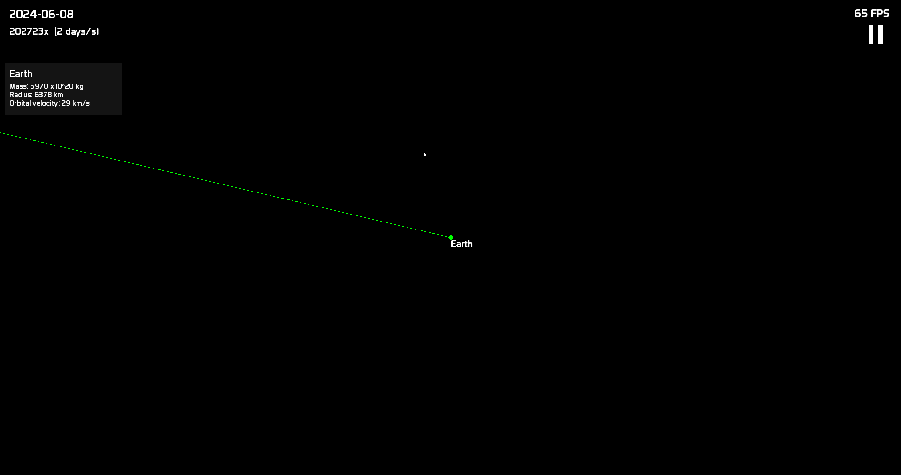

# Solar-System-Simulation
A numeric simulation for solar system using a simple Euler integration. Initial conditions are taken from NASA JPL Horizons database.

## Showcase



## Data

Data is taken from NASA JPL Horizons database. `fetch_data.py` is used to fetch data from the database and save it to a file. `combine_data.py` is used to combine data from `planet_sizes.json` and `planet_data.json` to a single file `planets.json` that is used in the simulation.

## Dependencies
* `SFML`

## Compilation
The project is compiled using `Makefile`. To compile the project, run ```make```.

## Execution
To run the project, run ```./simulation```.

## Controls
* `Space`: Pause/Resume simulation
* `Backspace`: Reverse simulation speed
* `x`: Increase simulation speed
* `y`: Decrease simulation speed

* `up/w`: Move camera up
* `down/s`: Move camera down
* `left/a`: Move camera left
* `right/d`: Move camera right

* `+`: Zoom in
* `-`: Zoom out

By clicking a planet you can follow it.